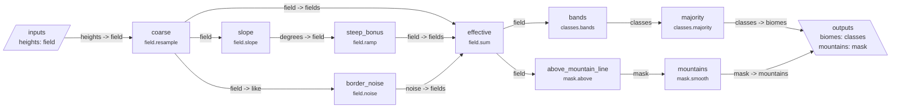

# Graph `biomes`

Generated with `automapgen show biomes` - do not edit by hand.

```mermaid
flowchart LR
  n_inputs[/"inputs<br/>heights: field"/]
  n_coarse["coarse<br/><small>field.resample</small>"]
  n_slope["slope<br/><small>field.slope</small>"]
  n_steep_bonus["steep_bonus<br/><small>field.ramp</small>"]
  n_border_noise["border_noise<br/><small>field.noise</small>"]
  n_effective["effective<br/><small>field.sum</small>"]
  n_bands["bands<br/><small>classes.bands</small>"]
  n_majority["majority<br/><small>classes.majority</small>"]
  n_above_mountain_line["above_mountain_line<br/><small>mask.above</small>"]
  n_mountains["mountains<br/><small>mask.smooth</small>"]
  n_outputs[\"outputs<br/>biomes: classes<br/>mountains: mask"\]
  n_inputs -- "heights -> field" --> n_coarse
  n_coarse -- "field" --> n_slope
  n_slope -- "degrees -> field" --> n_steep_bonus
  n_coarse -- "field -> like" --> n_border_noise
  n_coarse -- "field -> fields" --> n_effective
  n_steep_bonus -- "field -> fields" --> n_effective
  n_border_noise -- "noise -> fields" --> n_effective
  n_effective -- "field" --> n_bands
  n_bands -- "classes" --> n_majority
  n_effective -- "field" --> n_above_mountain_line
  n_above_mountain_line -- "mask" --> n_mountains
  n_majority -- "classes -> biomes" --> n_outputs
  n_mountains -- "mask -> mountains" --> n_outputs
```
