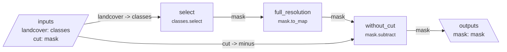

# Graph `class_mask`

Generated with `automapgen show class_mask` - do not edit by hand.

```mermaid
flowchart LR
  n_inputs[/"inputs<br/>landcover: classes<br/>cut: mask"/]
  n_select["select<br/><small>classes.select</small>"]
  n_full_resolution["full_resolution<br/><small>mask.to_map</small>"]
  n_without_cut["without_cut<br/><small>mask.subtract</small>"]
  n_outputs[\"outputs<br/>mask: mask"\]
  n_inputs -- "landcover -> classes" --> n_select
  n_select -- "mask" --> n_full_resolution
  n_full_resolution -- "mask" --> n_without_cut
  n_inputs -- "cut -> minus" --> n_without_cut
  n_without_cut -- "mask" --> n_outputs
```
