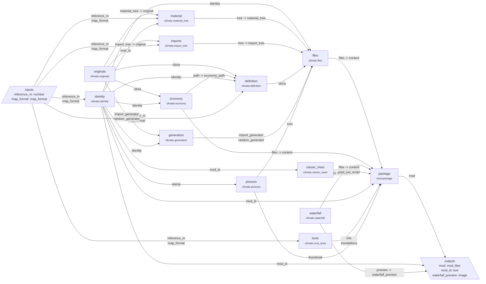

# Graph `climate_mod`

Generated with `automapgen show climate_mod` - do not edit by hand.

```mermaid
flowchart LR
  n_inputs[/"inputs<br/>reference_m: number<br/>map_format: map_format"/]
  n_originals["originals<br/><small>climate.originals</small>"]
  n_identity["identity<br/><small>climate.identity</small>"]
  n_material["material<br/><small>climate.material_tree</small>"]
  n_imports["imports<br/><small>climate.import_tree</small>"]
  n_economy["economy<br/><small>climate.economy</small>"]
  n_definition["definition<br/><small>climate.definition</small>"]
  n_generators["generators<br/><small>climate.generators</small>"]
  n_pictures["pictures<br/><small>climate.pictures</small>"]
  n_files["files<br/><small>climate.files</small>"]
  n_waterfall["waterfall<br/><small>climate.waterfall</small>"]
  n_classic_trees["classic_trees<br/><small>climate.classic_trees</small>"]
  n_texts["texts<br/><small>climate.mod_texts</small>"]
  n_package["package<br/><small>mod.package</small>"]
  n_outputs[\"outputs<br/>mod: mod_files<br/>mod_id: text<br/>waterfall_preview: image"\]
  n_inputs -- "reference_m<br/>map_format" --> n_identity
  n_originals -- "material_tree -> original" --> n_material
  n_inputs -- "reference_m<br/>map_format" --> n_material
  n_identity -- "mod_id" --> n_material
  n_originals -- "import_tree -> original" --> n_imports
  n_inputs -- "reference_m<br/>map_format" --> n_imports
  n_originals -- "clima" --> n_economy
  n_identity -- "identity" --> n_economy
  n_originals -- "clima" --> n_definition
  n_economy -- "path -> economy_path" --> n_definition
  n_identity -- "identity" --> n_definition
  n_inputs -- "reference_m<br/>map_format" --> n_definition
  n_originals -- "import_generator<br/>random_generator" --> n_generators
  n_identity -- "identity" --> n_generators
  n_identity -- "stamp" --> n_pictures
  n_identity -- "identity" --> n_files
  n_material -- "tree -> material_tree" --> n_files
  n_imports -- "tree -> import_tree" --> n_files
  n_definition -- "clima" --> n_files
  n_generators -- "import_generator<br/>random_generator" --> n_files
  n_pictures -- "icon" --> n_files
  n_inputs -- "reference_m<br/>map_format" --> n_texts
  n_identity -- "mod_id" --> n_classic_trees
  n_files -- "files -> content" --> n_package
  n_economy -- "files -> content" --> n_package
  n_waterfall -- "files -> content" --> n_package
  n_classic_trees -- "files -> content<br/>post_run_script" --> n_package
  n_identity -- "mod_id" --> n_package
  n_texts -- "info<br/>translations" --> n_package
  n_pictures -- "thumbnail" --> n_package
  n_package -- "mod" --> n_outputs
  n_identity -- "mod_id" --> n_outputs
  n_waterfall -- "preview -> waterfall_preview" --> n_outputs
```
