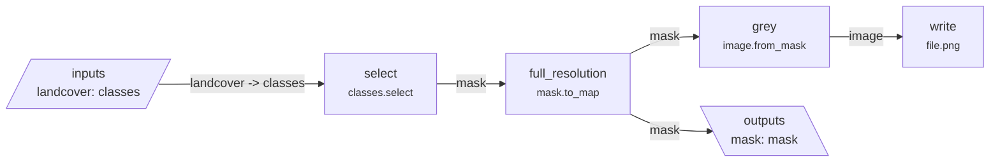

# Graph `import_layer`

Generated with `automapgen show import_layer` - do not edit by hand.

```mermaid
flowchart LR
  n_inputs[/"inputs<br/>landcover: classes"/]
  n_select["select<br/><small>classes.select</small>"]
  n_full_resolution["full_resolution<br/><small>mask.to_map</small>"]
  n_grey["grey<br/><small>image.from_mask</small>"]
  n_write["write<br/><small>file.png</small>"]
  n_outputs[\"outputs<br/>mask: mask"\]
  n_inputs -- "landcover -> classes" --> n_select
  n_select -- "mask" --> n_full_resolution
  n_full_resolution -- "mask" --> n_grey
  n_grey -- "image" --> n_write
  n_full_resolution -- "mask" --> n_outputs
```
