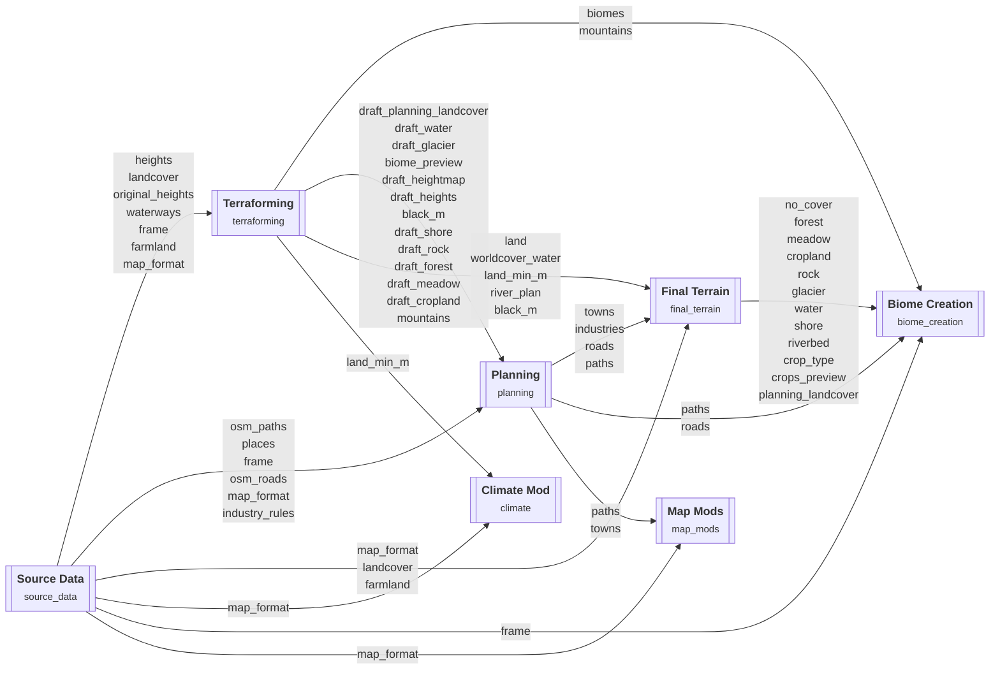

# Graph `map`

Generated with `automapgen show map` - do not edit by hand.

```mermaid
flowchart LR
  n_source_data[["<b>Source Data</b><br/><small>source_data</small>"]]
  n_terraforming[["<b>Terraforming</b><br/><small>terraforming</small>"]]
  n_planning[["<b>Planning</b><br/><small>planning</small>"]]
  n_final_terrain[["<b>Final Terrain</b><br/><small>final_terrain</small>"]]
  n_biome_creation[["<b>Biome Creation</b><br/><small>biome_creation</small>"]]
  n_climate[["<b>Climate Mod</b><br/><small>climate</small>"]]
  n_map_mods[["<b>Map Mods</b><br/><small>map_mods</small>"]]
  n_source_data -- "heights<br/>landcover<br/>original_heights<br/>waterways<br/>frame<br/>farmland<br/>map_format" --> n_terraforming
  n_terraforming -- "biomes<br/>mountains" --> n_biome_creation
  n_terraforming -- "draft_planning_landcover<br/>draft_water<br/>draft_glacier<br/>biome_preview<br/>draft_heightmap<br/>draft_heights<br/>black_m<br/>draft_shore<br/>draft_rock<br/>draft_forest<br/>draft_meadow<br/>draft_cropland<br/>mountains" --> n_planning
  n_source_data -- "osm_paths<br/>places<br/>frame<br/>osm_roads<br/>map_format<br/>industry_rules" --> n_planning
  n_terraforming -- "land<br/>worldcover_water<br/>land_min_m<br/>river_plan<br/>black_m" --> n_final_terrain
  n_source_data -- "map_format<br/>landcover<br/>farmland" --> n_final_terrain
  n_planning -- "towns<br/>industries<br/>roads<br/>paths" --> n_final_terrain
  n_planning -- "paths<br/>roads" --> n_biome_creation
  n_final_terrain -- "no_cover<br/>forest<br/>meadow<br/>cropland<br/>rock<br/>glacier<br/>water<br/>shore<br/>riverbed<br/>crop_type<br/>crops_preview<br/>planning_landcover" --> n_biome_creation
  n_terraforming -- "land_min_m" --> n_climate
  n_source_data -- "map_format" --> n_climate
  n_source_data -- "frame" --> n_biome_creation
  n_planning -- "paths<br/>towns" --> n_map_mods
  n_source_data -- "map_format" --> n_map_mods
```
