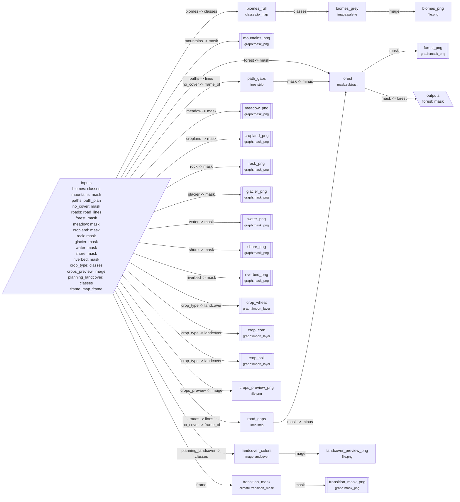

# Graph `map_biome_creation`

Generated with `automapgen show map_biome_creation` - do not edit by hand.

```mermaid
flowchart LR
  n_inputs[/"inputs<br/>biomes: classes<br/>mountains: mask<br/>paths: path_plan<br/>no_cover: mask<br/>roads: road_lines<br/>forest: mask<br/>meadow: mask<br/>cropland: mask<br/>rock: mask<br/>glacier: mask<br/>water: mask<br/>shore: mask<br/>riverbed: mask<br/>crop_type: classes<br/>crops_preview: image<br/>planning_landcover: classes<br/>frame: map_frame"/]
  n_biomes_full["biomes_full<br/><small>classes.to_map</small>"]
  n_biomes_grey["biomes_grey<br/><small>image.palette</small>"]
  n_biomes_png["biomes_png<br/><small>file.png</small>"]
  n_mountains_png[["mountains_png<br/><small>graph:mask_png</small>"]]
  n_path_gaps["path_gaps<br/><small>lines.strip</small>"]
  n_road_gaps["road_gaps<br/><small>lines.strip</small>"]
  n_forest["forest<br/><small>mask.subtract</small>"]
  n_forest_png[["forest_png<br/><small>graph:mask_png</small>"]]
  n_meadow_png[["meadow_png<br/><small>graph:mask_png</small>"]]
  n_cropland_png[["cropland_png<br/><small>graph:mask_png</small>"]]
  n_rock_png[["rock_png<br/><small>graph:mask_png</small>"]]
  n_glacier_png[["glacier_png<br/><small>graph:mask_png</small>"]]
  n_water_png[["water_png<br/><small>graph:mask_png</small>"]]
  n_shore_png[["shore_png<br/><small>graph:mask_png</small>"]]
  n_riverbed_png[["riverbed_png<br/><small>graph:mask_png</small>"]]
  n_crop_wheat[["crop_wheat<br/><small>graph:import_layer</small>"]]
  n_crop_corn[["crop_corn<br/><small>graph:import_layer</small>"]]
  n_crop_soil[["crop_soil<br/><small>graph:import_layer</small>"]]
  n_crops_preview_png["crops_preview_png<br/><small>file.png</small>"]
  n_landcover_colors["landcover_colors<br/><small>image.landcover</small>"]
  n_landcover_preview_png["landcover_preview_png<br/><small>file.png</small>"]
  n_transition_mask["transition_mask<br/><small>climate.transition_mask</small>"]
  n_transition_mask_png[["transition_mask_png<br/><small>graph:mask_png</small>"]]
  n_outputs[\"outputs<br/>forest: mask"\]
  n_inputs -- "biomes -> classes" --> n_biomes_full
  n_biomes_full -- "classes" --> n_biomes_grey
  n_biomes_grey -- "image" --> n_biomes_png
  n_inputs -- "mountains -> mask" --> n_mountains_png
  n_inputs -- "paths -> lines<br/>no_cover -> frame_of" --> n_path_gaps
  n_inputs -- "roads -> lines<br/>no_cover -> frame_of" --> n_road_gaps
  n_inputs -- "forest -> mask" --> n_forest
  n_path_gaps -- "mask -> minus" --> n_forest
  n_road_gaps -- "mask -> minus" --> n_forest
  n_forest -- "mask" --> n_forest_png
  n_inputs -- "meadow -> mask" --> n_meadow_png
  n_inputs -- "cropland -> mask" --> n_cropland_png
  n_inputs -- "rock -> mask" --> n_rock_png
  n_inputs -- "glacier -> mask" --> n_glacier_png
  n_inputs -- "water -> mask" --> n_water_png
  n_inputs -- "shore -> mask" --> n_shore_png
  n_inputs -- "riverbed -> mask" --> n_riverbed_png
  n_inputs -- "crop_type -> landcover" --> n_crop_wheat
  n_inputs -- "crop_type -> landcover" --> n_crop_corn
  n_inputs -- "crop_type -> landcover" --> n_crop_soil
  n_inputs -- "crops_preview -> image" --> n_crops_preview_png
  n_inputs -- "planning_landcover -> classes" --> n_landcover_colors
  n_landcover_colors -- "image" --> n_landcover_preview_png
  n_inputs -- "frame" --> n_transition_mask
  n_transition_mask -- "mask" --> n_transition_mask_png
  n_forest -- "mask -> forest" --> n_outputs
```
