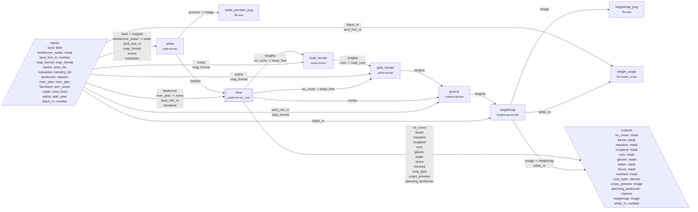

# Graph `map_final_terrain`

Generated with `automapgen show map_final_terrain` - do not edit by hand.

```mermaid
flowchart LR
  n_inputs[/"inputs<br/>land: field<br/>worldcover_water: mask<br/>land_min_m: number<br/>map_format: map_format<br/>towns: town_list<br/>industries: industry_list<br/>landcover: classes<br/>river_plan: river_plan<br/>farmland: osm_areas<br/>roads: road_lines<br/>paths: path_plan<br/>black_m: number"/]
  n_settle["settle<br/><small>settle.terrain</small>"]
  n_settle_preview_png["settle_preview_png<br/><small>file.png</small>"]
  n_final[["final<br/><small>graph:terrain_core</small>"]]
  n_road_terrain["road_terrain<br/><small>roads.terrain</small>"]
  n_path_terrain["path_terrain<br/><small>paths.terrain</small>"]
  n_groove["groove<br/><small>riverbed.groove</small>"]
  n_heightmap["heightmap<br/><small>heightmap.encode</small>"]
  n_heightmap_png["heightmap_png<br/><small>file.png</small>"]
  n_height_range["height_range<br/><small>file.height_range</small>"]
  n_outputs[\"outputs<br/>no_cover: mask<br/>forest: mask<br/>meadow: mask<br/>cropland: mask<br/>rock: mask<br/>glacier: mask<br/>water: mask<br/>shore: mask<br/>riverbed: mask<br/>crop_type: classes<br/>crops_preview: image<br/>planning_landcover: classes<br/>heightmap: image<br/>white_m: number"\]
  n_inputs -- "land -> heights<br/>worldcover_water -> water<br/>land_min_m<br/>map_format<br/>towns<br/>industries" --> n_settle
  n_settle -- "preview -> image" --> n_settle_preview_png
  n_settle -- "heights" --> n_final
  n_inputs -- "landcover<br/>river_plan -> rivers<br/>land_min_m<br/>farmland" --> n_final
  n_final -- "heights<br/>no_cover -> keep_free" --> n_road_terrain
  n_inputs -- "roads<br/>map_format" --> n_road_terrain
  n_road_terrain -- "heights<br/>core -> road_core" --> n_path_terrain
  n_inputs -- "paths<br/>map_format" --> n_path_terrain
  n_final -- "no_cover -> keep_free" --> n_path_terrain
  n_path_terrain -- "heights" --> n_groove
  n_final -- "centre" --> n_groove
  n_inputs -- "land_min_m<br/>map_format" --> n_groove
  n_groove -- "heights" --> n_heightmap
  n_inputs -- "black_m" --> n_heightmap
  n_heightmap -- "image" --> n_heightmap_png
  n_inputs -- "black_m<br/>land_min_m" --> n_height_range
  n_heightmap -- "white_m" --> n_height_range
  n_final -- "no_cover<br/>forest<br/>meadow<br/>cropland<br/>rock<br/>glacier<br/>water<br/>shore<br/>riverbed<br/>crop_type<br/>crops_preview<br/>planning_landcover" --> n_outputs
  n_heightmap -- "image -> heightmap<br/>white_m" --> n_outputs
```
