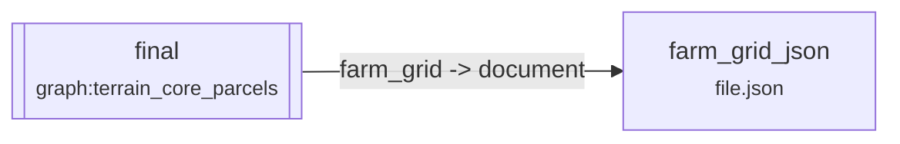

# Graph `map_final_terrain_parcels`

Generated with `automapgen show map_final_terrain_parcels` - do not edit by hand.

```mermaid
flowchart LR
  n_final[["final<br/><small>graph:terrain_core_parcels</small>"]]
  n_farm_grid_json["farm_grid_json<br/><small>file.json</small>"]
  n_final -- "farm_grid -> document" --> n_farm_grid_json
```
