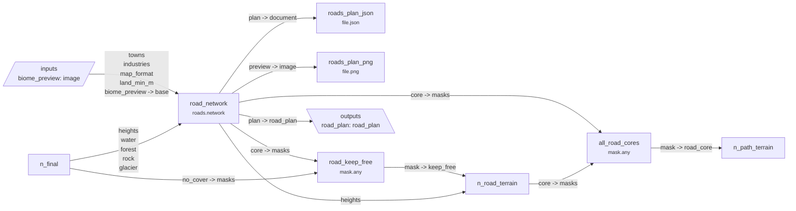

# Graph `map_final_terrain_roads`

Generated with `automapgen show map_final_terrain_roads` - do not edit by hand.

```mermaid
flowchart LR
  n_inputs[/"inputs<br/>biome_preview: image"/]
  n_road_network["road_network<br/><small>roads.network</small>"]
  n_roads_plan_json["roads_plan_json<br/><small>file.json</small>"]
  n_roads_plan_png["roads_plan_png<br/><small>file.png</small>"]
  n_road_keep_free["road_keep_free<br/><small>mask.any</small>"]
  n_all_road_cores["all_road_cores<br/><small>mask.any</small>"]
  n_outputs[\"outputs<br/>road_plan: road_plan"\]
  n_final -- "heights<br/>water<br/>forest<br/>rock<br/>glacier" --> n_road_network
  n_inputs -- "towns<br/>industries<br/>map_format<br/>land_min_m<br/>biome_preview -> base" --> n_road_network
  n_road_network -- "plan -> document" --> n_roads_plan_json
  n_road_network -- "preview -> image" --> n_roads_plan_png
  n_road_network -- "heights" --> n_road_terrain
  n_final -- "no_cover -> masks" --> n_road_keep_free
  n_road_network -- "core -> masks" --> n_road_keep_free
  n_road_keep_free -- "mask -> keep_free" --> n_road_terrain
  n_road_terrain -- "core -> masks" --> n_all_road_cores
  n_road_network -- "core -> masks" --> n_all_road_cores
  n_all_road_cores -- "mask -> road_core" --> n_path_terrain
  n_road_network -- "plan -> road_plan" --> n_outputs
```
