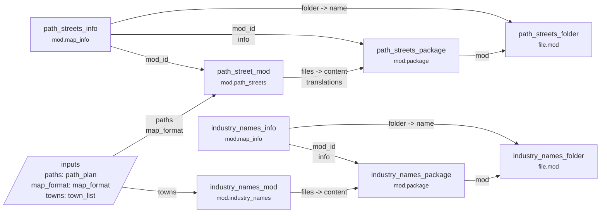

# Graph `map_mods`

Generated with `automapgen show map_mods` - do not edit by hand.

```mermaid
flowchart LR
  n_inputs[/"inputs<br/>paths: path_plan<br/>map_format: map_format<br/>towns: town_list"/]
  n_path_streets_info["path_streets_info<br/><small>mod.map_info</small>"]
  n_path_street_mod["path_street_mod<br/><small>mod.path_streets</small>"]
  n_path_streets_package["path_streets_package<br/><small>mod.package</small>"]
  n_path_streets_folder["path_streets_folder<br/><small>file.mod</small>"]
  n_industry_names_info["industry_names_info<br/><small>mod.map_info</small>"]
  n_industry_names_mod["industry_names_mod<br/><small>mod.industry_names</small>"]
  n_industry_names_package["industry_names_package<br/><small>mod.package</small>"]
  n_industry_names_folder["industry_names_folder<br/><small>file.mod</small>"]
  n_inputs -- "paths<br/>map_format" --> n_path_street_mod
  n_path_streets_info -- "mod_id" --> n_path_street_mod
  n_path_street_mod -- "files -> content<br/>translations" --> n_path_streets_package
  n_path_streets_info -- "mod_id<br/>info" --> n_path_streets_package
  n_path_streets_package -- "mod" --> n_path_streets_folder
  n_path_streets_info -- "folder -> name" --> n_path_streets_folder
  n_inputs -- "towns" --> n_industry_names_mod
  n_industry_names_mod -- "files -> content" --> n_industry_names_package
  n_industry_names_info -- "mod_id<br/>info" --> n_industry_names_package
  n_industry_names_package -- "mod" --> n_industry_names_folder
  n_industry_names_info -- "folder -> name" --> n_industry_names_folder
```
