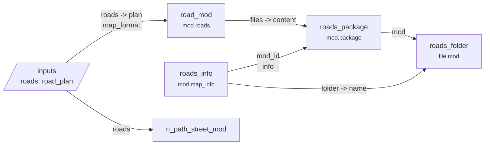

# Graph `map_mods_roads`

Generated with `automapgen show map_mods_roads` - do not edit by hand.

```mermaid
flowchart LR
  n_inputs[/"inputs<br/>roads: road_plan"/]
  n_roads_info["roads_info<br/><small>mod.map_info</small>"]
  n_road_mod["road_mod<br/><small>mod.roads</small>"]
  n_roads_package["roads_package<br/><small>mod.package</small>"]
  n_roads_folder["roads_folder<br/><small>file.mod</small>"]
  n_inputs -- "roads -> plan<br/>map_format" --> n_road_mod
  n_road_mod -- "files -> content" --> n_roads_package
  n_roads_info -- "mod_id<br/>info" --> n_roads_package
  n_roads_package -- "mod" --> n_roads_folder
  n_roads_info -- "folder -> name" --> n_roads_folder
  n_inputs -- "roads" --> n_path_street_mod
```
