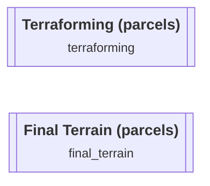

# Graph `map_parcels`

Generated with `automapgen show map_parcels` - do not edit by hand.

```mermaid
flowchart LR
  n_terraforming[["<b>Terraforming (parcels)</b><br/><small>terraforming</small>"]]
  n_final_terrain[["<b>Final Terrain (parcels)</b><br/><small>final_terrain</small>"]]
```
