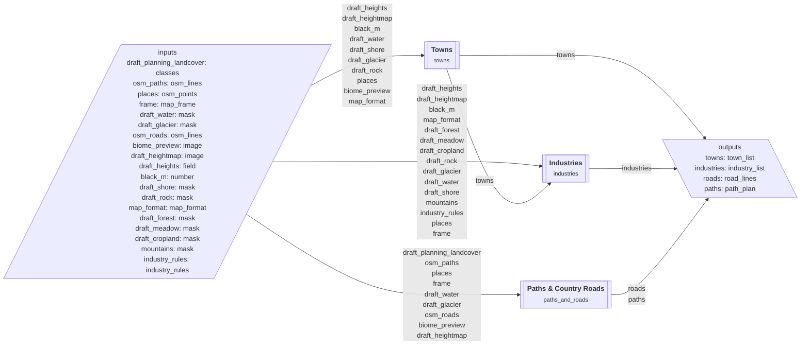

# Graph `map_planning`

Generated with `automapgen show map_planning` - do not edit by hand.

```mermaid
flowchart LR
  n_inputs[/"inputs<br/>draft_planning_landcover: classes<br/>osm_paths: osm_lines<br/>places: osm_points<br/>frame: map_frame<br/>draft_water: mask<br/>draft_glacier: mask<br/>osm_roads: osm_lines<br/>biome_preview: image<br/>draft_heightmap: image<br/>draft_heights: field<br/>black_m: number<br/>draft_shore: mask<br/>draft_rock: mask<br/>map_format: map_format<br/>draft_forest: mask<br/>draft_meadow: mask<br/>draft_cropland: mask<br/>mountains: mask<br/>industry_rules: industry_rules"/]
  n_paths_and_roads[["<b>Paths & Country Roads</b><br/><small>paths_and_roads</small>"]]
  n_towns[["<b>Towns</b><br/><small>towns</small>"]]
  n_industries[["<b>Industries</b><br/><small>industries</small>"]]
  n_outputs[\"outputs<br/>towns: town_list<br/>industries: industry_list<br/>roads: road_lines<br/>paths: path_plan"\]
  n_inputs -- "draft_planning_landcover<br/>osm_paths<br/>places<br/>frame<br/>draft_water<br/>draft_glacier<br/>osm_roads<br/>biome_preview<br/>draft_heightmap" --> n_paths_and_roads
  n_inputs -- "draft_heights<br/>draft_heightmap<br/>black_m<br/>draft_water<br/>draft_shore<br/>draft_glacier<br/>draft_rock<br/>places<br/>biome_preview<br/>map_format" --> n_towns
  n_inputs -- "draft_heights<br/>draft_heightmap<br/>black_m<br/>map_format<br/>draft_forest<br/>draft_meadow<br/>draft_cropland<br/>draft_rock<br/>draft_glacier<br/>draft_water<br/>draft_shore<br/>mountains<br/>industry_rules<br/>places<br/>frame" --> n_industries
  n_towns -- "towns" --> n_industries
  n_towns -- "towns" --> n_outputs
  n_industries -- "industries" --> n_outputs
  n_paths_and_roads -- "roads<br/>paths" --> n_outputs
```
