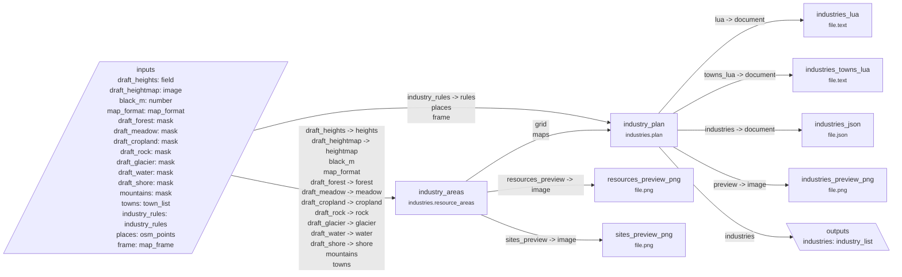

# Graph `map_planning_industries`

Generated with `automapgen show map_planning_industries` - do not edit by hand.

```mermaid
flowchart LR
  n_inputs[/"inputs<br/>draft_heights: field<br/>draft_heightmap: image<br/>black_m: number<br/>map_format: map_format<br/>draft_forest: mask<br/>draft_meadow: mask<br/>draft_cropland: mask<br/>draft_rock: mask<br/>draft_glacier: mask<br/>draft_water: mask<br/>draft_shore: mask<br/>mountains: mask<br/>towns: town_list<br/>industry_rules: industry_rules<br/>places: osm_points<br/>frame: map_frame"/]
  n_industry_areas["industry_areas<br/><small>industries.resource_areas</small>"]
  n_industry_plan["industry_plan<br/><small>industries.plan</small>"]
  n_industries_lua["industries_lua<br/><small>file.text</small>"]
  n_industries_towns_lua["industries_towns_lua<br/><small>file.text</small>"]
  n_industries_json["industries_json<br/><small>file.json</small>"]
  n_resources_preview_png["resources_preview_png<br/><small>file.png</small>"]
  n_sites_preview_png["sites_preview_png<br/><small>file.png</small>"]
  n_industries_preview_png["industries_preview_png<br/><small>file.png</small>"]
  n_outputs[\"outputs<br/>industries: industry_list"\]
  n_inputs -- "draft_heights -> heights<br/>draft_heightmap -> heightmap<br/>black_m<br/>map_format<br/>draft_forest -> forest<br/>draft_meadow -> meadow<br/>draft_cropland -> cropland<br/>draft_rock -> rock<br/>draft_glacier -> glacier<br/>draft_water -> water<br/>draft_shore -> shore<br/>mountains<br/>towns" --> n_industry_areas
  n_industry_areas -- "grid<br/>maps" --> n_industry_plan
  n_inputs -- "industry_rules -> rules<br/>places<br/>frame" --> n_industry_plan
  n_industry_plan -- "lua -> document" --> n_industries_lua
  n_industry_plan -- "towns_lua -> document" --> n_industries_towns_lua
  n_industry_plan -- "industries -> document" --> n_industries_json
  n_industry_areas -- "resources_preview -> image" --> n_resources_preview_png
  n_industry_areas -- "sites_preview -> image" --> n_sites_preview_png
  n_industry_plan -- "preview -> image" --> n_industries_preview_png
  n_industry_plan -- "industries" --> n_outputs
```
