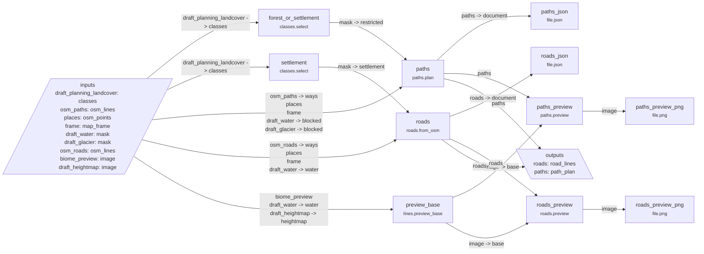

# Graph `map_planning_lines`

Generated with `automapgen show map_planning_lines` - do not edit by hand.

```mermaid
flowchart LR
  n_inputs[/"inputs<br/>draft_planning_landcover: classes<br/>osm_paths: osm_lines<br/>places: osm_points<br/>frame: map_frame<br/>draft_water: mask<br/>draft_glacier: mask<br/>osm_roads: osm_lines<br/>biome_preview: image<br/>draft_heightmap: image"/]
  n_forest_or_settlement["forest_or_settlement<br/><small>classes.select</small>"]
  n_settlement["settlement<br/><small>classes.select</small>"]
  n_paths["paths<br/><small>paths.plan</small>"]
  n_roads["roads<br/><small>roads.from_osm</small>"]
  n_paths_json["paths_json<br/><small>file.json</small>"]
  n_roads_json["roads_json<br/><small>file.json</small>"]
  n_preview_base["preview_base<br/><small>lines.preview_base</small>"]
  n_paths_preview["paths_preview<br/><small>paths.preview</small>"]
  n_paths_preview_png["paths_preview_png<br/><small>file.png</small>"]
  n_roads_preview["roads_preview<br/><small>roads.preview</small>"]
  n_roads_preview_png["roads_preview_png<br/><small>file.png</small>"]
  n_outputs[\"outputs<br/>roads: road_lines<br/>paths: path_plan"\]
  n_inputs -- "draft_planning_landcover -> classes" --> n_forest_or_settlement
  n_inputs -- "draft_planning_landcover -> classes" --> n_settlement
  n_inputs -- "osm_paths -> ways<br/>places<br/>frame<br/>draft_water -> blocked<br/>draft_glacier -> blocked" --> n_paths
  n_forest_or_settlement -- "mask -> restricted" --> n_paths
  n_inputs -- "osm_roads -> ways<br/>places<br/>frame<br/>draft_water -> water" --> n_roads
  n_settlement -- "mask -> settlement" --> n_roads
  n_paths -- "paths -> document" --> n_paths_json
  n_roads -- "roads -> document" --> n_roads_json
  n_inputs -- "biome_preview<br/>draft_water -> water<br/>draft_heightmap -> heightmap" --> n_preview_base
  n_preview_base -- "image -> base" --> n_paths_preview
  n_paths -- "paths" --> n_paths_preview
  n_paths_preview -- "image" --> n_paths_preview_png
  n_preview_base -- "image -> base" --> n_roads_preview
  n_roads -- "roads" --> n_roads_preview
  n_roads_preview -- "image" --> n_roads_preview_png
  n_roads -- "roads" --> n_outputs
  n_paths -- "paths" --> n_outputs
```
