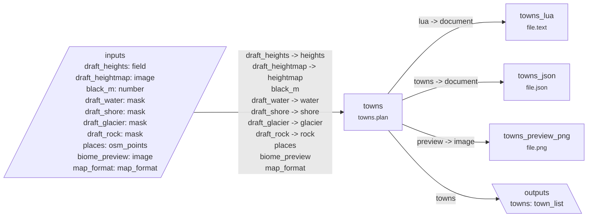

# Graph `map_planning_towns`

Generated with `automapgen show map_planning_towns` - do not edit by hand.

```mermaid
flowchart LR
  n_inputs[/"inputs<br/>draft_heights: field<br/>draft_heightmap: image<br/>black_m: number<br/>draft_water: mask<br/>draft_shore: mask<br/>draft_glacier: mask<br/>draft_rock: mask<br/>places: osm_points<br/>biome_preview: image<br/>map_format: map_format"/]
  n_towns["towns<br/><small>towns.plan</small>"]
  n_towns_lua["towns_lua<br/><small>file.text</small>"]
  n_towns_json["towns_json<br/><small>file.json</small>"]
  n_towns_preview_png["towns_preview_png<br/><small>file.png</small>"]
  n_outputs[\"outputs<br/>towns: town_list"\]
  n_inputs -- "draft_heights -> heights<br/>draft_heightmap -> heightmap<br/>black_m<br/>draft_water -> water<br/>draft_shore -> shore<br/>draft_glacier -> glacier<br/>draft_rock -> rock<br/>places<br/>biome_preview<br/>map_format" --> n_towns
  n_towns -- "lua -> document" --> n_towns_lua
  n_towns -- "towns -> document" --> n_towns_json
  n_towns -- "preview -> image" --> n_towns_preview_png
  n_towns -- "towns" --> n_outputs
```
