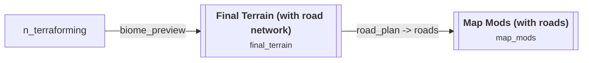

# Graph `map_roads`

Generated with `automapgen show map_roads` - do not edit by hand.

```mermaid
flowchart LR
  n_final_terrain[["<b>Final Terrain (with road network)</b><br/><small>final_terrain</small>"]]
  n_map_mods[["<b>Map Mods (with roads)</b><br/><small>map_mods</small>"]]
  n_terraforming -- "biome_preview" --> n_final_terrain
  n_final_terrain -- "road_plan -> roads" --> n_map_mods
```
