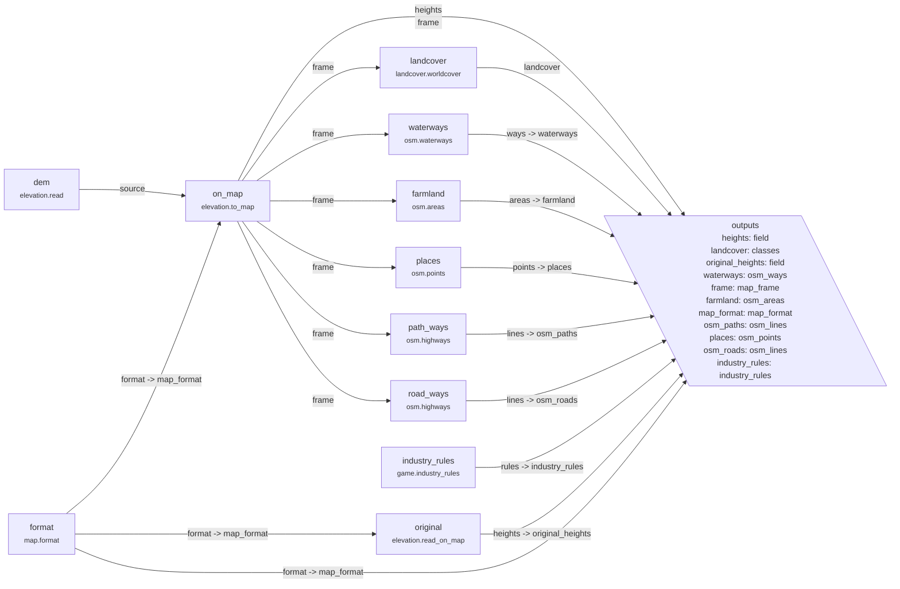

# Graph `map_source_data`

Generated with `automapgen show map_source_data` - do not edit by hand.

```mermaid
flowchart LR
  n_format["format<br/><small>map.format</small>"]
  n_dem["dem<br/><small>elevation.read</small>"]
  n_on_map["on_map<br/><small>elevation.to_map</small>"]
  n_original["original<br/><small>elevation.read_on_map</small>"]
  n_landcover["landcover<br/><small>landcover.worldcover</small>"]
  n_waterways["waterways<br/><small>osm.waterways</small>"]
  n_farmland["farmland<br/><small>osm.areas</small>"]
  n_places["places<br/><small>osm.points</small>"]
  n_path_ways["path_ways<br/><small>osm.highways</small>"]
  n_road_ways["road_ways<br/><small>osm.highways</small>"]
  n_industry_rules["industry_rules<br/><small>game.industry_rules</small>"]
  n_outputs[\"outputs<br/>heights: field<br/>landcover: classes<br/>original_heights: field<br/>waterways: osm_ways<br/>frame: map_frame<br/>farmland: osm_areas<br/>map_format: map_format<br/>osm_paths: osm_lines<br/>places: osm_points<br/>osm_roads: osm_lines<br/>industry_rules: industry_rules"\]
  n_dem -- "source" --> n_on_map
  n_format -- "format -> map_format" --> n_on_map
  n_on_map -- "heights<br/>frame" --> n_outputs
  n_on_map -- "frame" --> n_landcover
  n_landcover -- "landcover" --> n_outputs
  n_format -- "format -> map_format" --> n_original
  n_original -- "heights -> original_heights" --> n_outputs
  n_on_map -- "frame" --> n_waterways
  n_waterways -- "ways -> waterways" --> n_outputs
  n_on_map -- "frame" --> n_farmland
  n_farmland -- "areas -> farmland" --> n_outputs
  n_format -- "format -> map_format" --> n_outputs
  n_on_map -- "frame" --> n_places
  n_on_map -- "frame" --> n_path_ways
  n_on_map -- "frame" --> n_road_ways
  n_path_ways -- "lines -> osm_paths" --> n_outputs
  n_places -- "points -> places" --> n_outputs
  n_road_ways -- "lines -> osm_roads" --> n_outputs
  n_industry_rules -- "rules -> industry_rules" --> n_outputs
```
