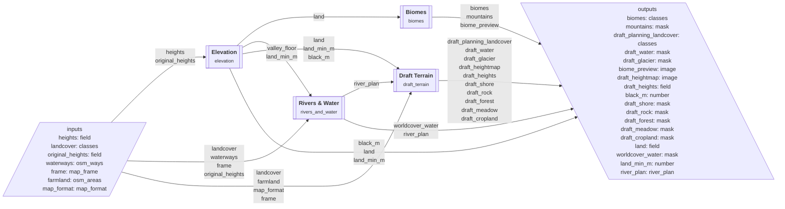

# Graph `map_terraforming`

Generated with `automapgen show map_terraforming` - do not edit by hand.

```mermaid
flowchart LR
  n_inputs[/"inputs<br/>heights: field<br/>landcover: classes<br/>original_heights: field<br/>waterways: osm_ways<br/>frame: map_frame<br/>farmland: osm_areas<br/>map_format: map_format"/]
  n_elevation[["<b>Elevation</b><br/><small>elevation</small>"]]
  n_biomes[["<b>Biomes</b><br/><small>biomes</small>"]]
  n_rivers_and_water[["<b>Rivers & Water</b><br/><small>rivers_and_water</small>"]]
  n_draft_terrain[["<b>Draft Terrain</b><br/><small>draft_terrain</small>"]]
  n_outputs[\"outputs<br/>biomes: classes<br/>mountains: mask<br/>draft_planning_landcover: classes<br/>draft_water: mask<br/>draft_glacier: mask<br/>biome_preview: image<br/>draft_heightmap: image<br/>draft_heights: field<br/>black_m: number<br/>draft_shore: mask<br/>draft_rock: mask<br/>draft_forest: mask<br/>draft_meadow: mask<br/>draft_cropland: mask<br/>land: field<br/>worldcover_water: mask<br/>land_min_m: number<br/>river_plan: river_plan"\]
  n_inputs -- "heights<br/>original_heights" --> n_elevation
  n_elevation -- "land" --> n_biomes
  n_biomes -- "biomes<br/>mountains<br/>biome_preview" --> n_outputs
  n_inputs -- "landcover<br/>waterways<br/>frame<br/>original_heights" --> n_rivers_and_water
  n_elevation -- "valley_floor<br/>land_min_m" --> n_rivers_and_water
  n_elevation -- "land<br/>land_min_m<br/>black_m" --> n_draft_terrain
  n_inputs -- "landcover<br/>farmland<br/>map_format<br/>frame" --> n_draft_terrain
  n_rivers_and_water -- "river_plan" --> n_draft_terrain
  n_draft_terrain -- "draft_planning_landcover<br/>draft_water<br/>draft_glacier<br/>draft_heightmap<br/>draft_heights<br/>draft_shore<br/>draft_rock<br/>draft_forest<br/>draft_meadow<br/>draft_cropland" --> n_outputs
  n_elevation -- "black_m<br/>land<br/>land_min_m" --> n_outputs
  n_rivers_and_water -- "worldcover_water<br/>river_plan" --> n_outputs
```
