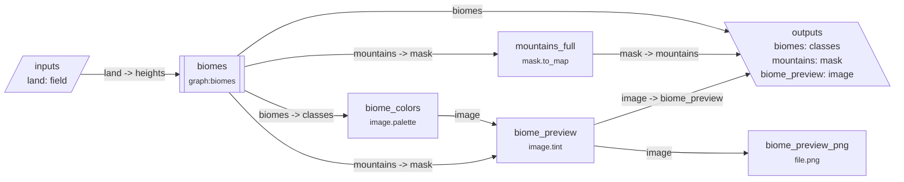

# Graph `map_terraforming_biomes`

Generated with `automapgen show map_terraforming_biomes` - do not edit by hand.

```mermaid
flowchart LR
  n_inputs[/"inputs<br/>land: field"/]
  n_biomes[["biomes<br/><small>graph:biomes</small>"]]
  n_mountains_full["mountains_full<br/><small>mask.to_map</small>"]
  n_biome_colors["biome_colors<br/><small>image.palette</small>"]
  n_biome_preview["biome_preview<br/><small>image.tint</small>"]
  n_biome_preview_png["biome_preview_png<br/><small>file.png</small>"]
  n_outputs[\"outputs<br/>biomes: classes<br/>mountains: mask<br/>biome_preview: image"\]
  n_inputs -- "land -> heights" --> n_biomes
  n_biomes -- "biomes" --> n_outputs
  n_biomes -- "mountains -> mask" --> n_mountains_full
  n_mountains_full -- "mask -> mountains" --> n_outputs
  n_biomes -- "biomes -> classes" --> n_biome_colors
  n_biome_colors -- "image" --> n_biome_preview
  n_biomes -- "mountains -> mask" --> n_biome_preview
  n_biome_preview -- "image" --> n_biome_preview_png
  n_biome_preview -- "image -> biome_preview" --> n_outputs
```
