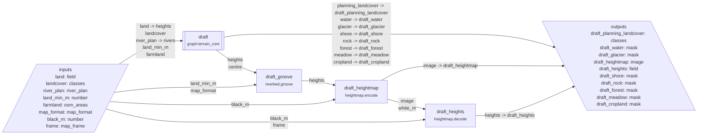

# Graph `map_terraforming_draft`

Generated with `automapgen show map_terraforming_draft` - do not edit by hand.

```mermaid
flowchart LR
  n_inputs[/"inputs<br/>land: field<br/>landcover: classes<br/>river_plan: river_plan<br/>land_min_m: number<br/>farmland: osm_areas<br/>map_format: map_format<br/>black_m: number<br/>frame: map_frame"/]
  n_draft[["draft<br/><small>graph:terrain_core</small>"]]
  n_draft_groove["draft_groove<br/><small>riverbed.groove</small>"]
  n_draft_heightmap["draft_heightmap<br/><small>heightmap.encode</small>"]
  n_draft_heights["draft_heights<br/><small>heightmap.decode</small>"]
  n_outputs[\"outputs<br/>draft_planning_landcover: classes<br/>draft_water: mask<br/>draft_glacier: mask<br/>draft_heightmap: image<br/>draft_heights: field<br/>draft_shore: mask<br/>draft_rock: mask<br/>draft_forest: mask<br/>draft_meadow: mask<br/>draft_cropland: mask"\]
  n_inputs -- "land -> heights<br/>landcover<br/>river_plan -> rivers<br/>land_min_m<br/>farmland" --> n_draft
  n_draft -- "heights<br/>centre" --> n_draft_groove
  n_inputs -- "land_min_m<br/>map_format" --> n_draft_groove
  n_draft_groove -- "heights" --> n_draft_heightmap
  n_inputs -- "black_m" --> n_draft_heightmap
  n_draft_heightmap -- "image<br/>white_m" --> n_draft_heights
  n_inputs -- "black_m<br/>frame" --> n_draft_heights
  n_draft -- "planning_landcover -> draft_planning_landcover<br/>water -> draft_water<br/>glacier -> draft_glacier<br/>shore -> draft_shore<br/>rock -> draft_rock<br/>forest -> draft_forest<br/>meadow -> draft_meadow<br/>cropland -> draft_cropland" --> n_outputs
  n_draft_heightmap -- "image -> draft_heightmap" --> n_outputs
  n_draft_heights -- "heights -> draft_heights" --> n_outputs
```
