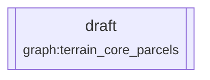

# Graph `map_terraforming_draft_parcels`

Generated with `automapgen show map_terraforming_draft_parcels` - do not edit by hand.

```mermaid
flowchart LR
  n_draft[["draft<br/><small>graph:terrain_core_parcels</small>"]]
```
