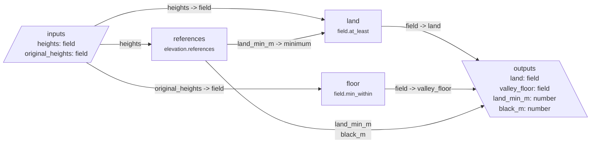

# Graph `map_terraforming_elevation`

Generated with `automapgen show map_terraforming_elevation` - do not edit by hand.

```mermaid
flowchart LR
  n_inputs[/"inputs<br/>heights: field<br/>original_heights: field"/]
  n_references["references<br/><small>elevation.references</small>"]
  n_land["land<br/><small>field.at_least</small>"]
  n_floor["floor<br/><small>field.min_within</small>"]
  n_outputs[\"outputs<br/>land: field<br/>valley_floor: field<br/>land_min_m: number<br/>black_m: number"\]
  n_inputs -- "heights" --> n_references
  n_inputs -- "heights -> field" --> n_land
  n_references -- "land_min_m -> minimum" --> n_land
  n_land -- "field -> land" --> n_outputs
  n_inputs -- "original_heights -> field" --> n_floor
  n_floor -- "field -> valley_floor" --> n_outputs
  n_references -- "land_min_m<br/>black_m" --> n_outputs
```
