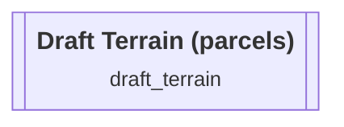

# Graph `map_terraforming_parcels`

Generated with `automapgen show map_terraforming_parcels` - do not edit by hand.

```mermaid
flowchart LR
  n_draft_terrain[["<b>Draft Terrain (parcels)</b><br/><small>draft_terrain</small>"]]
```
