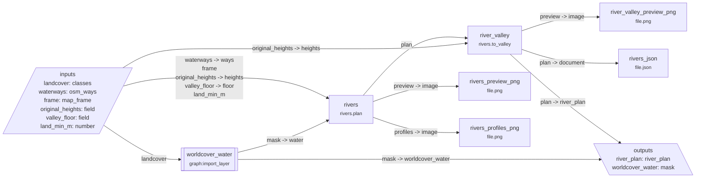

# Graph `map_terraforming_rivers`

Generated with `automapgen show map_terraforming_rivers` - do not edit by hand.

```mermaid
flowchart LR
  n_inputs[/"inputs<br/>landcover: classes<br/>waterways: osm_ways<br/>frame: map_frame<br/>original_heights: field<br/>valley_floor: field<br/>land_min_m: number"/]
  n_worldcover_water[["worldcover_water<br/><small>graph:import_layer</small>"]]
  n_rivers["rivers<br/><small>rivers.plan</small>"]
  n_river_valley["river_valley<br/><small>rivers.to_valley</small>"]
  n_river_valley_preview_png["river_valley_preview_png<br/><small>file.png</small>"]
  n_rivers_json["rivers_json<br/><small>file.json</small>"]
  n_rivers_preview_png["rivers_preview_png<br/><small>file.png</small>"]
  n_rivers_profiles_png["rivers_profiles_png<br/><small>file.png</small>"]
  n_outputs[\"outputs<br/>river_plan: river_plan<br/>worldcover_water: mask"\]
  n_inputs -- "landcover" --> n_worldcover_water
  n_inputs -- "waterways -> ways<br/>frame<br/>original_heights -> heights<br/>valley_floor -> floor<br/>land_min_m" --> n_rivers
  n_worldcover_water -- "mask -> water" --> n_rivers
  n_rivers -- "plan" --> n_river_valley
  n_inputs -- "original_heights -> heights" --> n_river_valley
  n_river_valley -- "preview -> image" --> n_river_valley_preview_png
  n_river_valley -- "plan -> document" --> n_rivers_json
  n_rivers -- "preview -> image" --> n_rivers_preview_png
  n_rivers -- "profiles -> image" --> n_rivers_profiles_png
  n_river_valley -- "plan -> river_plan" --> n_outputs
  n_worldcover_water -- "mask -> worldcover_water" --> n_outputs
```
