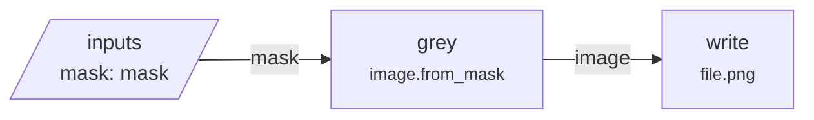

# Graph `mask_png`

Generated with `automapgen show mask_png` - do not edit by hand.

```mermaid
flowchart LR
  n_inputs[/"inputs<br/>mask: mask"/]
  n_grey["grey<br/><small>image.from_mask</small>"]
  n_write["write<br/><small>file.png</small>"]
  n_inputs -- "mask" --> n_grey
  n_grey -- "image" --> n_write
```
