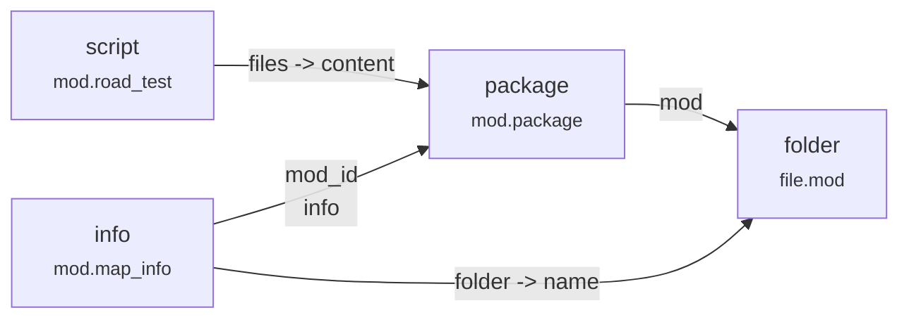

# Graph `road_test`

Generated with `automapgen show road_test` - do not edit by hand.

```mermaid
flowchart LR
  n_info["info<br/><small>mod.map_info</small>"]
  n_script["script<br/><small>mod.road_test</small>"]
  n_package["package<br/><small>mod.package</small>"]
  n_folder["folder<br/><small>file.mod</small>"]
  n_script -- "files -> content" --> n_package
  n_info -- "mod_id<br/>info" --> n_package
  n_package -- "mod" --> n_folder
  n_info -- "folder -> name" --> n_folder
```
