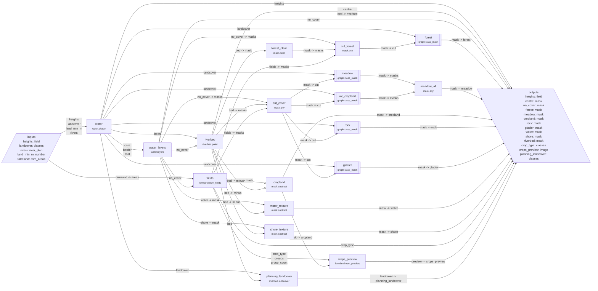

# Graph `terrain_core`

Generated with `automapgen show terrain_core` - do not edit by hand.

```mermaid
flowchart LR
  n_inputs[/"inputs<br/>heights: field<br/>landcover: classes<br/>rivers: river_plan<br/>land_min_m: number<br/>farmland: osm_areas"/]
  n_water["water<br/><small>water.shape</small>"]
  n_water_layers["water_layers<br/><small>water.layers</small>"]
  n_riverbed["riverbed<br/><small>riverbed.paint</small>"]
  n_forest_clear["forest_clear<br/><small>mask.near</small>"]
  n_fields["fields<br/><small>farmland.osm_fields</small>"]
  n_cut_cover["cut_cover<br/><small>mask.any</small>"]
  n_cut_forest["cut_forest<br/><small>mask.any</small>"]
  n_forest[["forest<br/><small>graph:class_mask</small>"]]
  n_meadow[["meadow<br/><small>graph:class_mask</small>"]]
  n_wc_cropland[["wc_cropland<br/><small>graph:class_mask</small>"]]
  n_meadow_all["meadow_all<br/><small>mask.any</small>"]
  n_rock[["rock<br/><small>graph:class_mask</small>"]]
  n_glacier[["glacier<br/><small>graph:class_mask</small>"]]
  n_cropland["cropland<br/><small>mask.subtract</small>"]
  n_water_texture["water_texture<br/><small>mask.subtract</small>"]
  n_shore_texture["shore_texture<br/><small>mask.subtract</small>"]
  n_planning_landcover["planning_landcover<br/><small>riverbed.landcover</small>"]
  n_crops_preview["crops_preview<br/><small>farmland.osm_preview</small>"]
  n_outputs[\"outputs<br/>heights: field<br/>centre: mask<br/>no_cover: mask<br/>forest: mask<br/>meadow: mask<br/>cropland: mask<br/>rock: mask<br/>glacier: mask<br/>water: mask<br/>shore: mask<br/>riverbed: mask<br/>crop_type: classes<br/>crops_preview: image<br/>planning_landcover: classes"\]
  n_inputs -- "heights<br/>landcover<br/>land_min_m<br/>rivers" --> n_water
  n_water -- "core<br/>border<br/>real" --> n_water_layers
  n_water -- "beds" --> n_riverbed
  n_water_layers -- "no_cover" --> n_riverbed
  n_riverbed -- "bed -> mask" --> n_forest_clear
  n_inputs -- "farmland -> areas" --> n_fields
  n_water_layers -- "no_cover" --> n_fields
  n_water_layers -- "no_cover -> masks" --> n_cut_cover
  n_riverbed -- "bed -> masks" --> n_cut_cover
  n_fields -- "fields -> masks" --> n_cut_cover
  n_water_layers -- "no_cover -> masks" --> n_cut_forest
  n_forest_clear -- "mask -> masks" --> n_cut_forest
  n_fields -- "fields -> masks" --> n_cut_forest
  n_water -- "landcover" --> n_forest
  n_cut_forest -- "mask -> cut" --> n_forest
  n_water -- "landcover" --> n_meadow
  n_cut_cover -- "mask -> cut" --> n_meadow
  n_water -- "landcover" --> n_wc_cropland
  n_cut_cover -- "mask -> cut" --> n_wc_cropland
  n_meadow -- "mask -> masks" --> n_meadow_all
  n_wc_cropland -- "mask -> masks" --> n_meadow_all
  n_water -- "landcover" --> n_rock
  n_cut_cover -- "mask -> cut" --> n_rock
  n_water -- "landcover" --> n_glacier
  n_cut_cover -- "mask -> cut" --> n_glacier
  n_fields -- "fields -> mask" --> n_cropland
  n_riverbed -- "bed -> minus" --> n_cropland
  n_water_layers -- "water -> mask" --> n_water_texture
  n_riverbed -- "bed -> minus" --> n_water_texture
  n_water_layers -- "shore -> mask" --> n_shore_texture
  n_riverbed -- "bed -> minus" --> n_shore_texture
  n_water -- "landcover" --> n_planning_landcover
  n_riverbed -- "bed" --> n_planning_landcover
  n_water -- "heights" --> n_outputs
  n_riverbed -- "centre<br/>bed -> riverbed" --> n_outputs
  n_water_layers -- "no_cover" --> n_outputs
  n_forest -- "mask -> forest" --> n_outputs
  n_meadow_all -- "mask -> meadow" --> n_outputs
  n_cropland -- "mask -> cropland" --> n_outputs
  n_rock -- "mask -> rock" --> n_outputs
  n_glacier -- "mask -> glacier" --> n_outputs
  n_water_texture -- "mask -> water" --> n_outputs
  n_shore_texture -- "mask -> shore" --> n_outputs
  n_fields -- "crop_type" --> n_outputs
  n_fields -- "crop_type<br/>groups<br/>group_count" --> n_crops_preview
  n_cropland -- "mask -> cropland" --> n_crops_preview
  n_crops_preview -- "preview -> crops_preview" --> n_outputs
  n_planning_landcover -- "landcover -> planning_landcover" --> n_outputs
```
