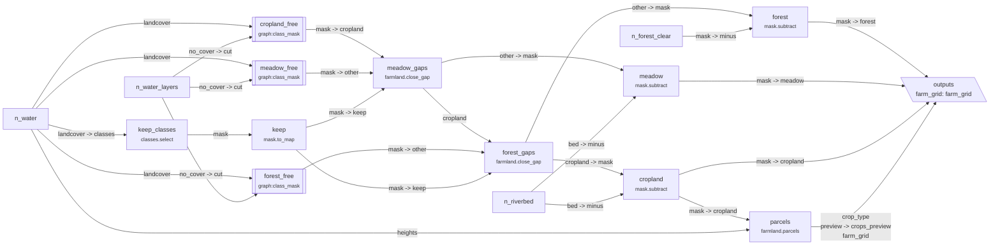

# Graph `terrain_core_parcels`

Generated with `automapgen show terrain_core_parcels` - do not edit by hand.

```mermaid
flowchart LR
  n_keep_classes["keep_classes<br/><small>classes.select</small>"]
  n_keep["keep<br/><small>mask.to_map</small>"]
  n_cropland_free[["cropland_free<br/><small>graph:class_mask</small>"]]
  n_meadow_free[["meadow_free<br/><small>graph:class_mask</small>"]]
  n_forest_free[["forest_free<br/><small>graph:class_mask</small>"]]
  n_meadow_gaps["meadow_gaps<br/><small>farmland.close_gap</small>"]
  n_forest_gaps["forest_gaps<br/><small>farmland.close_gap</small>"]
  n_cropland["cropland<br/><small>mask.subtract</small>"]
  n_meadow["meadow<br/><small>mask.subtract</small>"]
  n_forest["forest<br/><small>mask.subtract</small>"]
  n_parcels["parcels<br/><small>farmland.parcels</small>"]
  n_outputs[\"outputs<br/>farm_grid: farm_grid"\]
  n_water -- "landcover -> classes" --> n_keep_classes
  n_keep_classes -- "mask" --> n_keep
  n_water -- "landcover" --> n_cropland_free
  n_water_layers -- "no_cover -> cut" --> n_cropland_free
  n_water -- "landcover" --> n_meadow_free
  n_water_layers -- "no_cover -> cut" --> n_meadow_free
  n_water -- "landcover" --> n_forest_free
  n_water_layers -- "no_cover -> cut" --> n_forest_free
  n_cropland_free -- "mask -> cropland" --> n_meadow_gaps
  n_meadow_free -- "mask -> other" --> n_meadow_gaps
  n_keep -- "mask -> keep" --> n_meadow_gaps
  n_meadow_gaps -- "cropland" --> n_forest_gaps
  n_forest_free -- "mask -> other" --> n_forest_gaps
  n_keep -- "mask -> keep" --> n_forest_gaps
  n_forest_gaps -- "cropland -> mask" --> n_cropland
  n_riverbed -- "bed -> minus" --> n_cropland
  n_meadow_gaps -- "other -> mask" --> n_meadow
  n_riverbed -- "bed -> minus" --> n_meadow
  n_forest_gaps -- "other -> mask" --> n_forest
  n_forest_clear -- "mask -> minus" --> n_forest
  n_cropland -- "mask -> cropland" --> n_parcels
  n_water -- "heights" --> n_parcels
  n_forest -- "mask -> forest" --> n_outputs
  n_meadow -- "mask -> meadow" --> n_outputs
  n_cropland -- "mask -> cropland" --> n_outputs
  n_parcels -- "crop_type<br/>preview -> crops_preview<br/>farm_grid" --> n_outputs
```
